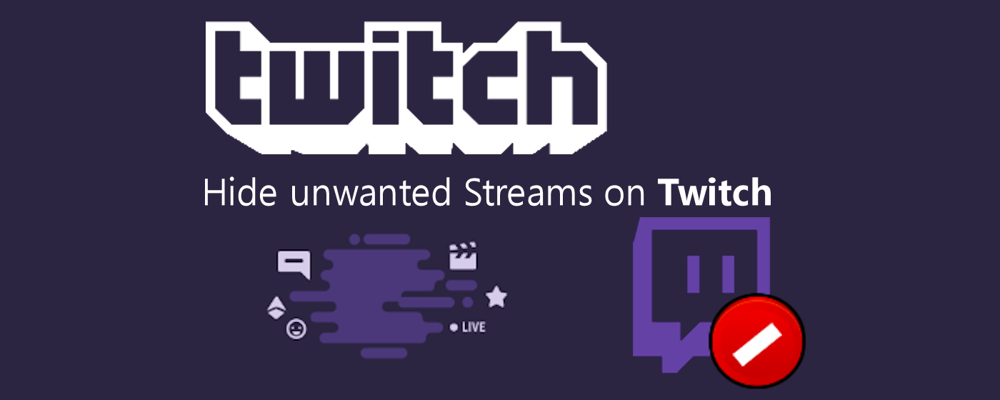

# Hide unwanted streams, games, categories, channels and tags on: twitch.tv

## Download
- [Chrome Web Store](https://chrome.google.com/webstore/detail/unwanted-twitch/egbpddkgpjmliolmpjenjomflclekjld)
- [Firefox Add-ons](https://addons.mozilla.org/firefox/addon/unwanted-twitch/)
- [Microsoft Edge-Add-Ons](https://microsoftedge.microsoft.com/addons/detail/unwanted-twitch/jkhpefiopamdlihbichhnhmpfgomefmh)
- other [Chromium based browsers](https://en.wikipedia.org/wiki/Chromium_(web_browser)#Browsers_based_on_Chromium) (such as Opera, Brave and Vivaldi) are compatible and allow you to load the extension too

## Features
- hide unwanted categories/games
- hide unwanted channels/streams
- hide unwanted tags
- hide stream reruns
- hide streams based on their title
- filtering on "Following" page can be disabled (in settings)
- toggle visibility of "X" buttons
- share blacklists using import/export (in settings)
- blacklist is automatically synced between devices (in settings, can be deactivated)
- one-click-toggle to disable/enable extension (click on the extension icon to access)
- compatible with FrankerFaceZ (FFZ) and BetterTTV (BTTV)
- supports Twitch's Dark Mode

## Supported pages
- Browse: Categories
- Browse: Live Channels
- Game: Live Channels
- Game: Videos
- Game: Clips
- Frontpage/Discover (carousel is not filtered)
- Following
- Sidebar (filtering only, no buttons to add items to the blacklist)
- you can still access any blacklisted content via direct link

## Note about breaking changes on twitch.tv
Twitch is infamous for changing their website without further notice, which may break this extension over night (usually on Tuesdays). Twitch also serves different [canary builds](https://whatis.techtarget.com/definition/canary-canary-testing) (previews of potential future versions) to selected/random users for up to 4 weeks, which most likely break parts of the extension. If you notice pages no longer working properly, disable the extension, [report the issue](https://github.com/kwaschny/unwanted-twitch/issues) (you can also send me an e-mail or DM me on Twitter) and wait for an update. Note that updates may take a few days to be approved on the corresponding browser stores. Keep an eye on [the GitHub commits](https://github.com/kwaschny/unwanted-twitch/commits/master) or [follow me on Twitter](https://twitter.com/Kwaschny) to receive news regarding new versions. Please avoid leaving a 1-star review as this will neither help the case nor increase my mood. Thank you. 🙂

## Support the ongoing development of this extension
I am working on this extension in my spare time. And although I don't watch twitch.tv that much anymore, I still want people to be able to hide content they are not interested in. So as long as Twitch doesn't offer a native way to achieve that, I will continue developing this extension and make it work with future updates to the twitch.tv website. If you want to support me, feel free to spread the word and/or [consider a tip](https://www.paypal.me/devservice/5eur). ❤️

## Tips
| Donor | Amount in € | Date |
| ----- | ----------: | ---- |
| Kevin N. | 5.00 | 2021-05 |
| INTERAKT CO | 10.00 | 2021-03 |
| Russell K. | 5.00 | 2020-09 |
| Andrew S. | 5.00 | 2019-11 |
| Максим Д. | 10.00 | 2018-11 |

## Contributing to this extension
Regardless if you are a regular user or a developer yourself, [check out the contribution page for information about how you can help this project](CONTRIBUTING.md).

## Translations
| Language | Translator |
| -------- | ----------- |
| English | [kwaschny](https://github.com/kwaschny) |
| German | [kwaschny](https://github.com/kwaschny) |
| Spanish | [JoseSM](https://github.com/JoseSM) |

## How it works
The extension is loaded after the requested twitch.tv page is fully served and completely relies on the present DOM. It adds button controls to specific nodes that can be used to add the underlying item to the blacklist. The blacklist is held in the storage, either local or synced (can be adjusted in the settings). Once there are items on the blacklist, supported pages are filtered by going through item nodes, matching game/category, channel or tags. A successful match hides the topmost node and marks it as being hidden. Most detections are interval based node comparisons instead of observing mutations in the DOM (I find it more consistent, especially because of the seamless page navigation on Twitch), that's why you might notice a minor flicker effect once in a while.
